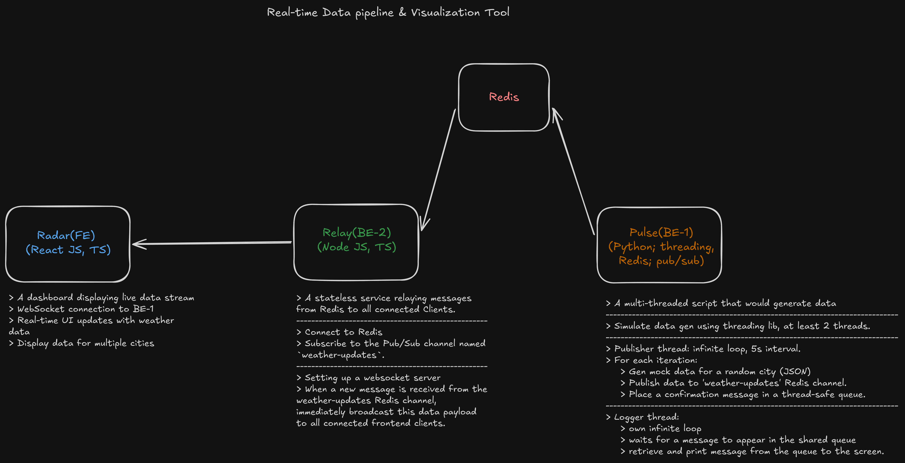

# RTDP — Real-Time Data Pipeline



A containerized real-time weather data pipeline with live dashboard visualization using Python, Node.js, and Next.js.

## Services

| Service | Description | Role |
|---------|-------------|------|
| **Pulse** (`/pulse`) | Python Publisher | Generates mock weather data every 5s |
| **Relay** (`/relay`) | Node.js Broker | Broadcasts data to frontend via WebSockets |
| **Radar** (`/radar`) | Next.js Frontend | Live minimalist React weather dashboard |
| **Redis** | Message Bus | Pub/Sub backbone connecting Pulse to Relay |

## How to Run

**Prerequisites:** You only need Docker installed.

1. Copy the example environment file:
   ```bash
   cp .env.example .env
   ```

2. Launch the entire stack (Standard Mode):
   ```bash
   docker compose up --build
   ```

   **Or launch in Development Mode (Live Hot-Reloading):**
   ```bash
   docker compose watch
   ```
   *(Use `watch` if you are actively editing the code. Any changes saved to `src/` or `app/` folders will automatically hot-reload the containers without needing a rebuild!)*

   **To view logs while using `watch`:**
   Open a separate terminal and run:
   ```bash
   docker compose logs -f
   ```

3. Open your browser and go to:
   **`http://localhost:3000`**

*The dashboard will automatically connect and stream live weather updates every 5 seconds.*
